# Hi there, I'm Jericho Bien 👋
## About Me
Aspiring developer, where I love to build side-projects and contribute related to **Math and Statistics**. And I’m open to collaboration on projects anytime.
You may contact me at jerichobien360@gmail.com.

> [!TIP]
> **Fun Fact:** I love listening **lo-fi music**, where it keeps me motivated while debugging and learn new skills.

## Projects
You may look around on my projects that I'm doing right now:
 
* [Arena of Shadows](https://github.com/jerichobien360/Arena-of-Shadows) - A medium-large scale RPG game prototype written in pure Python

Others:
* [Portfolio Website](https://github.com/jerichobien360/portfolio-website)
* [E-commerce Sales Data Analysis](https://github.com/jerichobien360/data-analysis-portfolio)

## Programming Languages
These are the programming languages that I have used over the years and continue to learn about to this day. You may look around at what tools I'm used to:
#### Mainly Used:

#### Others:

## Frameworks & Libraries
#### Game Development:

#### Web Development:
     

#### Data Science and Machine Learning:
    

#### Software Tools:
   

## Daily Habit Streak Summary

## 🔗 Connect with me
LinkedIn: <a href="https://www.linkedin.com/in/jericho-bien-5b751a321/" target="_blank" rel="noopener noreferrer">jerichobien360</a>
 
Gmail: <a href="https://mail.google.com/mail/?view=cm&fs=1&to=jerichobien360@gmail.com" target="_blank" rel="noopener noreferrer">jerichobien360@gmail.com</a>
